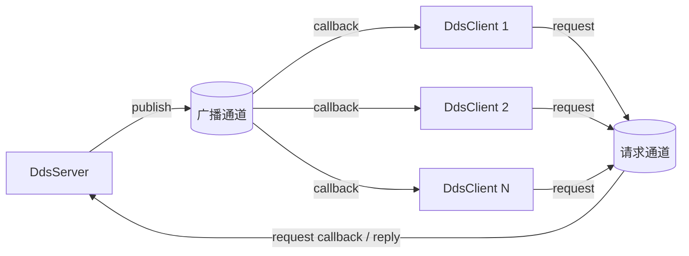
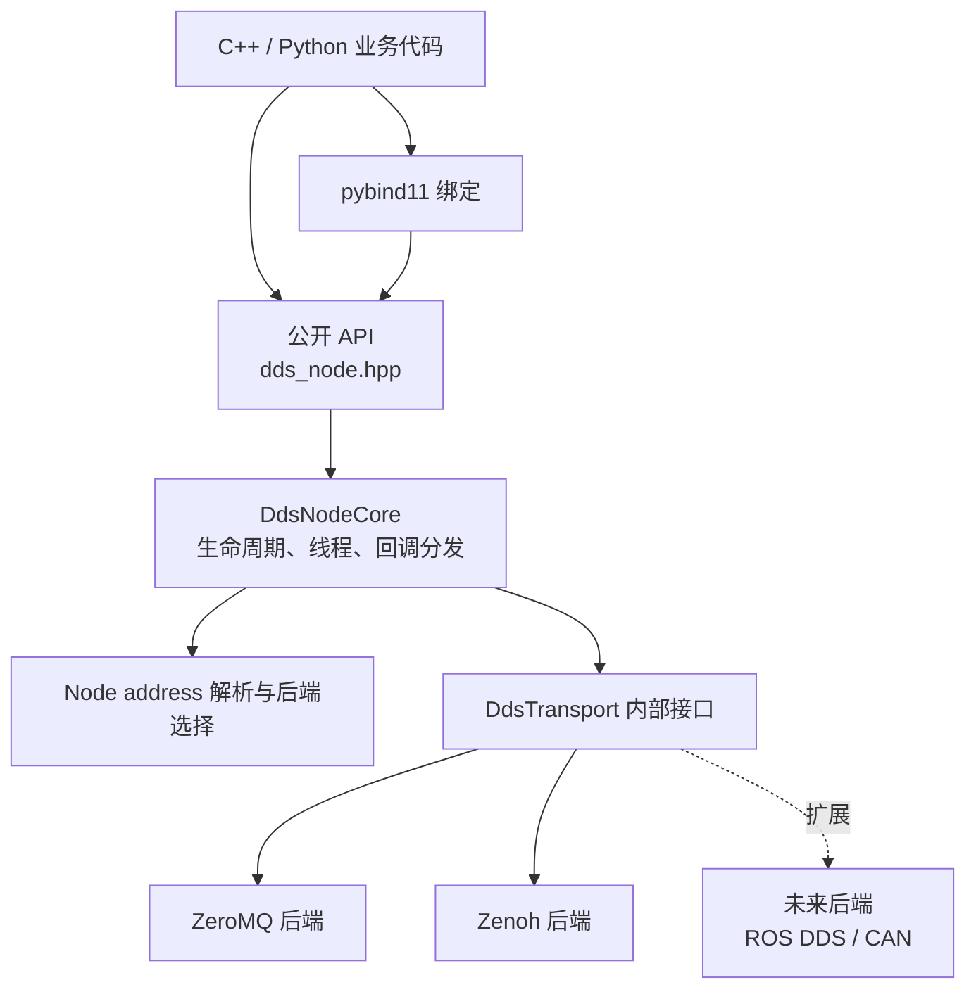
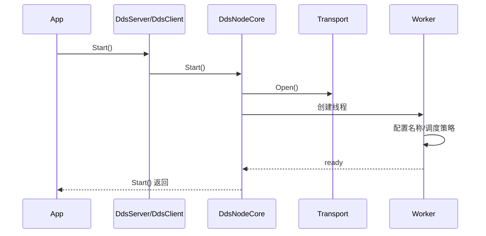

# dds_abstract 架构设计文档

## 1. 文档信息

| 项目 | 内容 |
|---|---|
| 软件名称 | `dds_abstract` |
| 当前版本 | 1.0.0 |
| ABI 主版本 | 1 |
| 语言标准 | C++17 |
| 最低 CMake 版本 | 3.16 |
| 当前后端 | ZeroMQ、Zenoh |
| 规划扩展 | ROS DDS、CAN/CANopen 等 |

## 2. 设计目标

本库为上层业务提供与具体通信协议无关的节点接口。业务只配置广播和请求两个
node address，不直接依赖 ZeroMQ 或 Zenoh 类型。内部根据地址格式选择传输后端。

核心目标如下：

- 将发布/订阅和请求/应答统一到一组稳定的公开 API。
- 明确分离 server 与 client 的职责。
- 广播通道和请求通道相互独立，可以采用不同协议。
- 任一通道可以不配置，但两个地址不能同时为空。
- 通过回调处理广播、请求和异步错误。
- 提供工作线程命名、调度策略和优先级配置。
- 通过 PImpl 和内部传输接口隐藏协议库，保持公开头文件稳定。
- 同时提供 C++ 和 Python API。

## 3. 系统上下文



server 在广播通道发布消息，并在请求通道接收和应答请求。多个 client 订阅同一广播
通道，也可以分别向同一 server 发起同步请求。

## 4. 分层架构



### 4.1 公开接口层

唯一公开头文件是 `include/dds_abstract/dds_node.hpp`，包含：

- `DdsServer`：发布广播、注册请求处理回调。
- `DdsClient`：订阅广播、发起同步请求。
- `DdsServerConfig`、`DdsClientConfig`：地址及线程配置。
- `DdsByteView`、`DdsBytes`：二进制消息视图和所有权容器。
- `DdsThreadConfig`、`DdsSchedulingPolicy`：工作线程配置。

公开头文件不包含 ZeroMQ 或 Zenoh 头文件。`DdsServer` 和 `DdsClient` 使用 PImpl，
协议实现变化不会直接传播到应用代码。

### 4.2 核心协调层

`DdsNodeCore` 是 server/client 共用的内部实现，负责：

- 验证节点配置。
- 分别解析广播地址和请求地址。
- 为两个通道分别创建传输对象。
- 打开和关闭传输资源。
- 创建工作线程并应用线程配置。
- 接收消息，并将消息分发给广播或请求回调。
- 捕获工作线程异常并调用错误回调。

广播和请求各自持有一个 `DdsTransport`。因此下面的混合配置是合法的：

```text
broadcast_node_address = 127.0.0.1:8080     # ZeroMQ
request_node_address   = dpm/param/query    # Zenoh
```

### 4.3 地址解析层

地址不携带 `zeromq://` 或 `zenoh://` 前缀。内部采用以下确定性规则：

| 地址形式 | 后端 | 内部资源 |
|---|---|---|
| `192.168.0.10:8080` | ZeroMQ | `tcp://192.168.0.10:8080` |
| `inproc://events` | ZeroMQ | `inproc://events` |
| `inproc/events` | ZeroMQ | 规范化为 inproc 地址 |
| `dpm/param/events` | Zenoh | Zenoh key expression |

IPv4 每段必须在 0～255 之间，端口必须在 1～65535 之间。疑似 ZeroMQ 但格式错误的
地址会抛出 `std::invalid_argument`，不会退化为 Zenoh key。

### 4.4 传输抽象层

内部 `DdsTransport` 定义统一能力：

```text
Open / Close
Publish
Request
TryReceive
Reply
```

`DdsIncomingMessage` 使用 `Kind` 区分广播和请求，并携带后端不透明的
`correlation_id`。关联信息只在内部使用，不暴露给业务层。

新增协议后端时，需要实现 `DdsTransport`、增加工厂分支和地址识别规则；公开的
`DdsServer`/`DdsClient` API 无需改变。

## 5. 协议映射

| 抽象语义 | ZeroMQ | Zenoh |
|---|---|---|
| server 广播 | PUB | Publisher `put` |
| client 订阅 | SUB | Subscriber |
| client 请求 | DEALER 请求端 | `get`/query |
| server 应答 | ROUTER 服务端 | Queryable reply |
| 多 client | ROUTER 按连接标识应答 | Zenoh query/reply 关联 |

ZeroMQ inproc 地址只在同一进程、同一 ZeroMQ context 中有效，适合单元测试和进程内
组件通信；跨进程必须使用 IPv4 地址。Zenoh 使用默认 session 配置，实际发现和路由
行为由部署环境中的 Zenoh 配置决定。

## 6. 生命周期与时序

### 6.1 启动



`Start()` 只有在线程配置成功后才返回。如果 `strict=true` 且实时配置失败，启动失败，
并关闭已经打开的传输资源。

### 6.2 请求/应答

client 的 `Request()` 是同步接口。后端等待应答直至成功或超时；同一个 client 传输中
的并发请求会被串行化。server 的请求回调在其工作线程中执行，返回值会作为应答发送。
未设置请求回调时，server 返回空消息。

### 6.3 广播

server 调用 `Publish()` 后由选定后端发送。client 的接收工作线程调用广播回调。
发布/订阅通常存在发现或连接建立窗口，应用不应把启动后的第一条广播当作可靠的
连接握手；需要可靠确认时应使用请求/应答通道。

### 6.4 停止

`Stop()` 设置停止标志、关闭传输并等待工作线程退出。析构函数会自动调用 `Stop()`。
重复调用 `Stop()` 是安全的。

## 7. 线程和实时性

每个 `DdsServer` 或 `DdsClient` 拥有一个接收/回调工作线程。

| 平台 | 线程名称 | 调度/优先级 |
|---|---|---|
| Linux | `pthread_setname_np`，最长保留 15 字节 | `SCHED_FIFO` / `SCHED_RR` |
| Windows | `SetThreadDescription` | `SetThreadPriority` |

Linux 实时调度通常需要 `CAP_SYS_NICE` 或相应系统权限。`strict=false` 时配置失败不会
阻止节点运行；`strict=true` 时失败会令 `Start()` 抛出异常。

实时性边界：本库允许提升回调线程优先级，但 Python GIL、动态内存分配、协议发现、
网络栈以及用户回调执行时间仍可能引入抖动。因此 Python 接口不应被视为硬实时接口，
C++ 用户也应避免在实时回调中执行阻塞 I/O 或无界耗时操作。

## 8. 并发与数据所有权

- `DdsByteView` 不拥有数据，只保证在当前 API 调用或回调期间有效。
- 跨回调保存消息时必须复制为 `DdsBytes`。
- 回调注册受互斥锁保护；执行回调前会复制回调对象，不在回调执行期间持有该锁。
- `Publish()` 和 `Request()` 只允许在节点启动后调用。
- 地址和工作线程配置只能在 `Start()` 前修改。
- `DdsServer`、`DdsClient` 不可复制。
- 用户回调抛出的异常由工作循环捕获，并转发给 `OnError()`；错误回调自身的异常会被
  吞掉，以保护工作线程。

## 9. Python 绑定

Python 模块由 pybind11 生成。Python 的 `bytes` 在进入 C++ 时复制为 `DdsBytes`，
C++ 消息传给 Python 时复制为 `bytes`。调用 Python 回调前会获取 GIL；阻塞的
`request()` 和 `stop()` 会释放 GIL，以免阻塞其他 Python 线程。

公开 Python 类型为 `Server`、`Client`、`SchedulingPolicy` 和 `__version__`。

## 10. 构建、打包和交付

- CMake 目标：`dds_abstract`；安装后的目标：`dds::dds_abstract`。
- Linux 共享库：`libdds_abstract.so.1.0.0`，SONAME 主版本为 1。
- Conan 包：`dds_abstract/1.0.0`。
- ZeroMQ 的 Conan 依赖：`cppzmq/4.11.0`，间接依赖 `zeromq/4.3.5`。
- Zenoh 当前从系统安装的 `zenoh-c`、`zenoh-cpp` CMake package 获取。
- Python 绑定是 Conan 可选项，默认关闭。

## 11. 测试策略

| 测试 | 覆盖内容 |
|---|---|
| `dds_node_test` | 地址、生命周期、空通道配置及基础行为 |
| `dds_zeromq_test` | ZeroMQ，1 server + 4 clients，广播和请求应答 |
| `dds_zenoh_test` | Zenoh，1 server + 4 clients，广播和请求应答 |
| `dds_mixed_protocol_test` | 广播和请求使用不同协议 |
| `dds_python_test.py` | Python server/client、回调、广播和请求应答 |
| `test_package` | Conan 包被独立 CMake 工程消费 |

## 12. 已知限制与演进方向

- 当前只识别 IPv4 ZeroMQ TCP 地址，不识别主机名和 IPv6。
- 每个节点仅配置一个广播地址和一个请求地址。
- client 请求为同步接口，单个 client 的并发请求会串行执行。
- 未提供消息持久化、重试、鉴权、加密或应用层 schema。
- Zenoh 尚未纳入 ConanCenter 依赖闭包。
- ROS DDS、CAN/CANopen 仅保留架构扩展点，当前未实现。

未来扩展协议时应保持公开 API 与消息语义稳定，并为新后端补充一对多、超时、关闭、
错误传播和混合协议测试。
