# dds_abstract UML 图册

本文档对应 `dds_abstract` 1.0.0，图中只展示当前已实现的 ZeroMQ 和 Zenoh；
ROS DDS、CAN/CANopen 作为后续扩展点标识。

## 1. 总体架构图

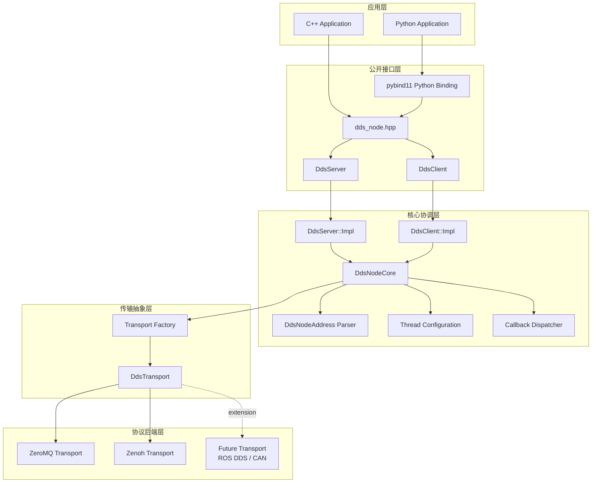

## 2. 模块框图

广播和请求通道分别解析地址、选择协议并持有独立传输实例，因此两个通道可以使用
不同协议。

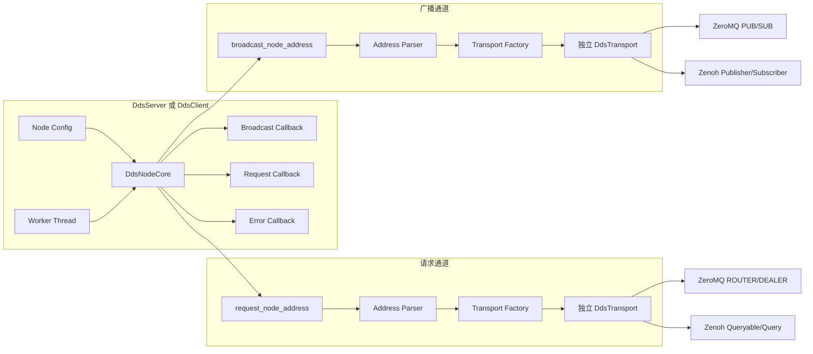

## 3. 核心类图

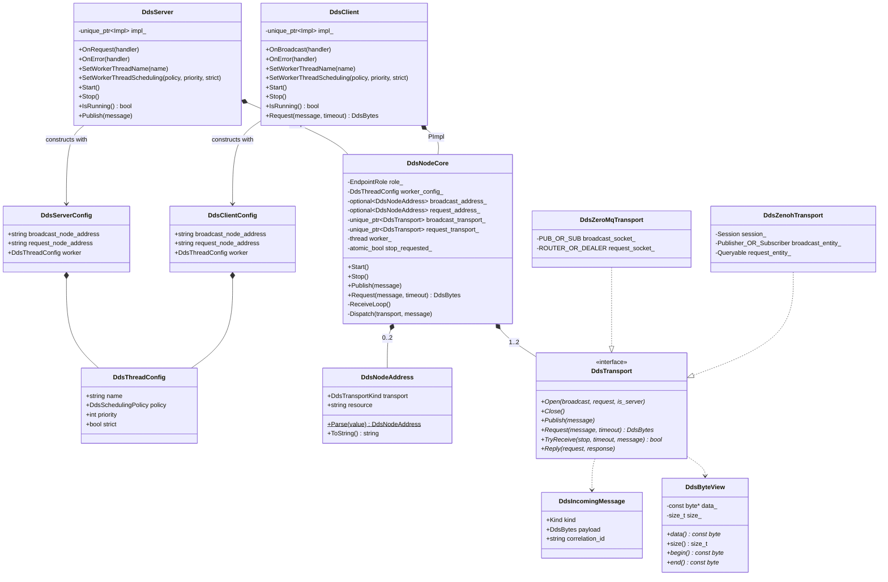

## 4. 地址选择活动图

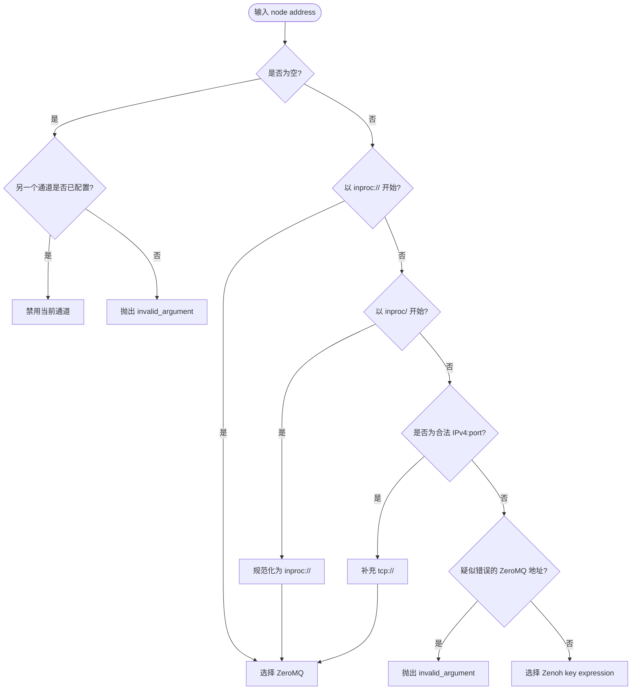

## 5. 节点启动时序图

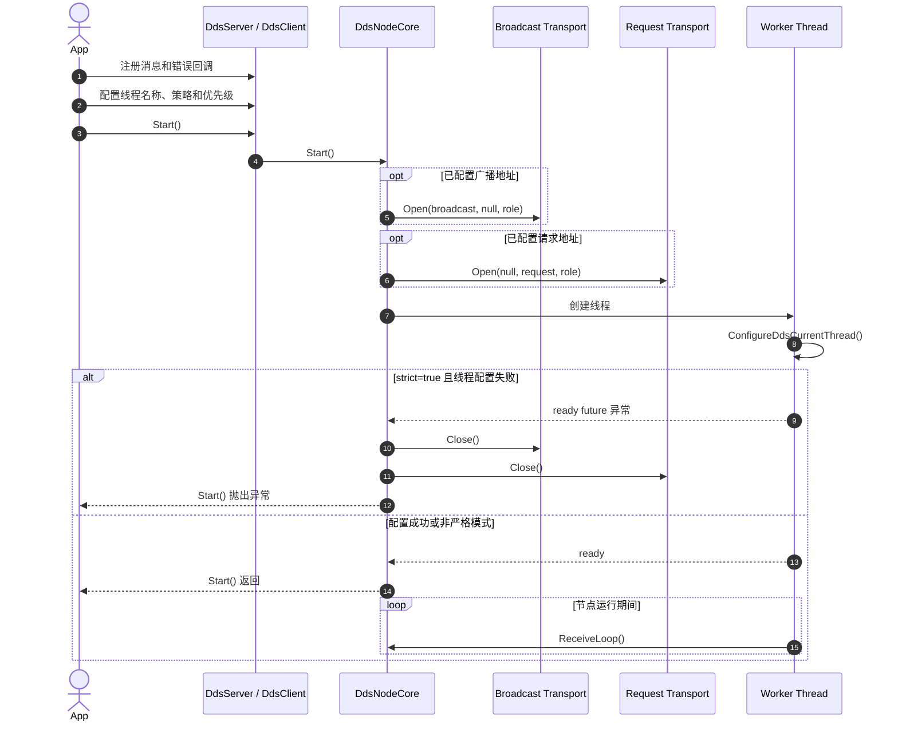

## 6. 广播时序图

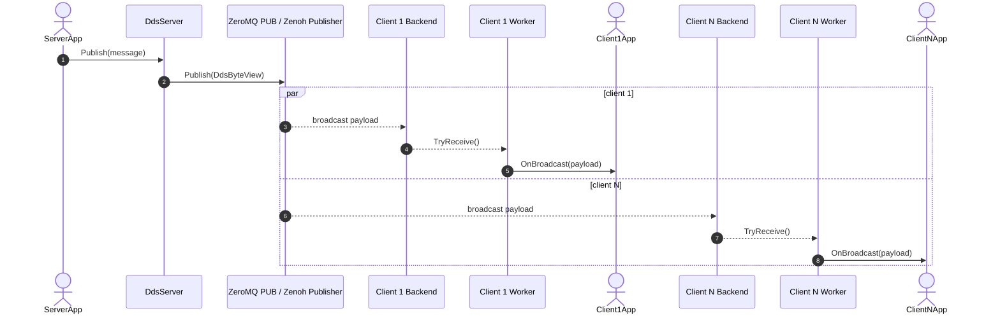

## 7. 请求/应答时序图

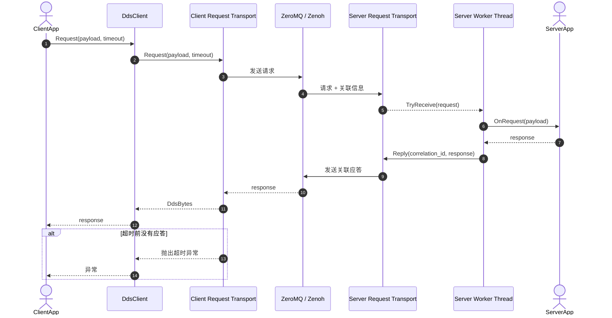

## 8. 错误处理时序图

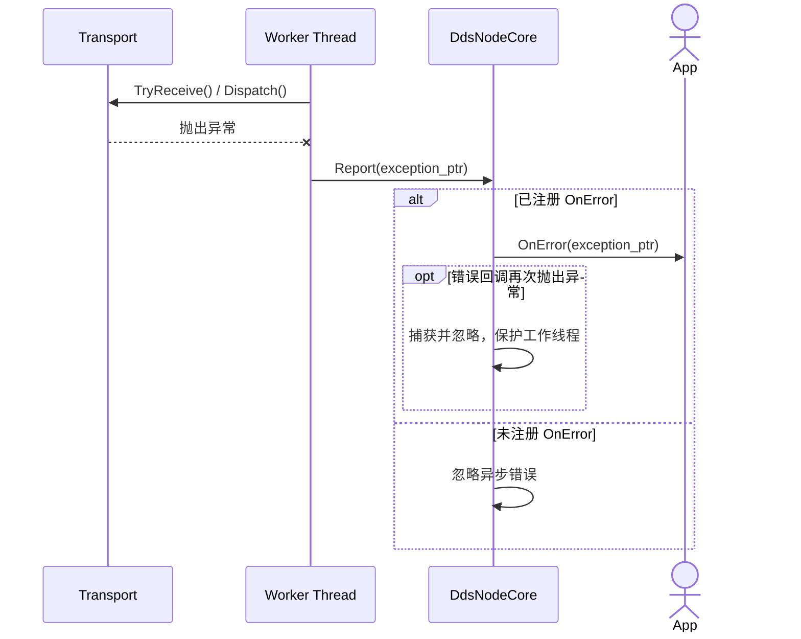

## 9. 单进程部署图

ZeroMQ `inproc` 适用于同一进程内的组件通信。所有节点共享库内的 ZeroMQ context。

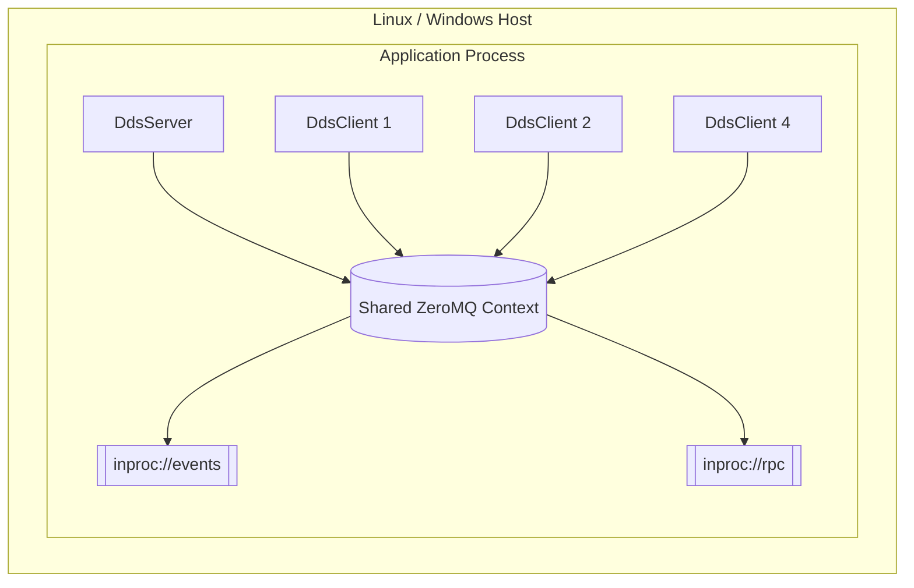

## 10. 跨主机混合协议部署图

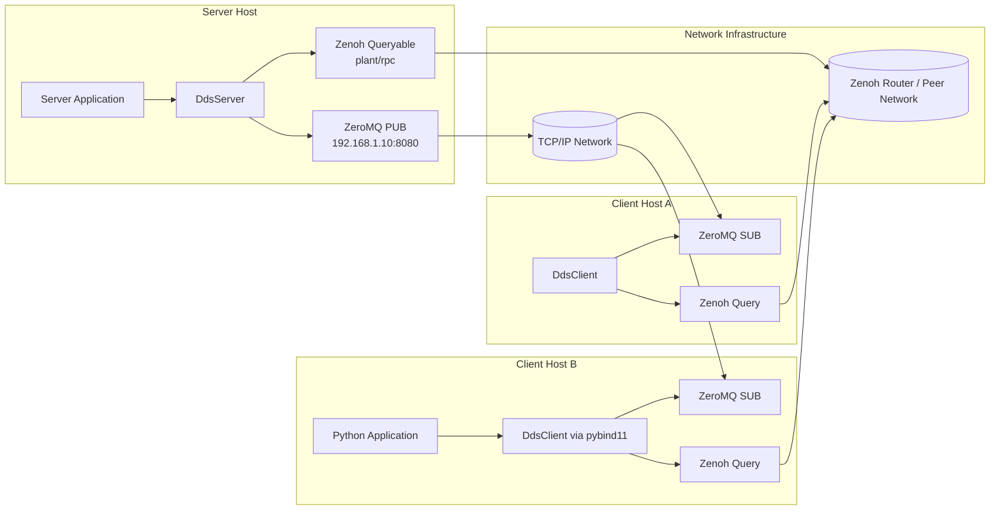

该部署示例中：

- 广播地址为 `192.168.1.10:8080`，自动选择 ZeroMQ。
- 请求地址为 `plant/rpc`，自动选择 Zenoh。
- server 的 ZeroMQ 端执行 `bind`，client 执行 `connect`。
- Zenoh 节点通过默认 session 发现彼此；是否部署 router 取决于实际网络拓扑。
- C++ 和 Python 节点在协议层完全互通，消息均表现为二进制数据。

## 11. 构建与交付部署图

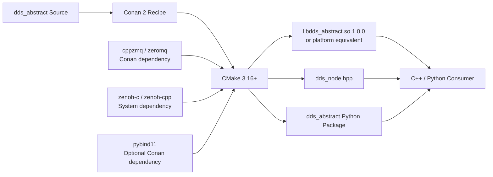

## 12. 图例

| 表示 | 含义 |
|---|---|
| 实线箭头 | 当前实现中的直接依赖或调用 |
| 虚线箭头 | 规划中的扩展关系 |
| `broadcast_transport_` | 广播通道专用传输实例 |
| `request_transport_` | 请求通道专用传输实例 |
| `correlation_id` | 后端内部请求关联信息，不属于公开 API |
